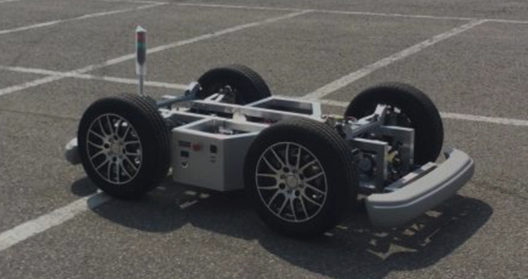

# ERP42 ROS Package

Common ROS packages for the [Unmanned Solution](http://www.unmansol.com/index.html) ERP42, useable for both simulation and real robot operation.

- [packages](https://github.com/jdj2261/ERP-ROS/tree/master/packages)

  

    
detail package

  - erp42_bringup
  - erp42_communications
  - erp42_driver
  - erp42_msgs
  - erp42_navigation
  - erp42_sensors
  - erp42_slam
  - erp42_teleop
  - erp42_vehicle

  

- [etc](https://github.com/jdj2261/ERP-ROS/tree/master/etc)
  
  - erp42_detectors
  - erp42_slams

<left></left>

> ERP42 stands for Education Robot Platform and it is the educational platform of vehicle type that the students and researchers can easily test vehicle control, fusion of sensors and self-driving algorithm by replacing real vehicle platform as it have the similar driving, steering and break system to the real one.

## 1. packages

These packages will guide you on setting up a ERP42 robot PC with ROS melodic.

## 2. etc

**1. erp42_detector**

These packages are cloned [here](https://github.com/tysik/obstacle_detector).

The **obstacle_detector** package provides utilities to detect and track obstacles from data provided by 2D laser scanners. Detected obstacles come in a form of line segments or circles.

**2. erp42_3d_slam**

These packages are cloned [here](https://github.com/koide3/hdl_graph_slam).

The **hdl_graph_slam** package is an open source ROS package for real-time 6DOF SLAM using a 3D LIDAR.