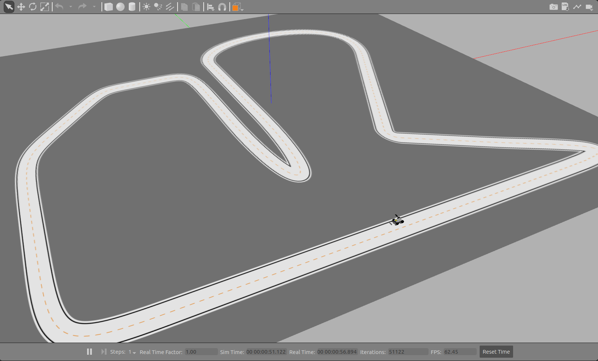
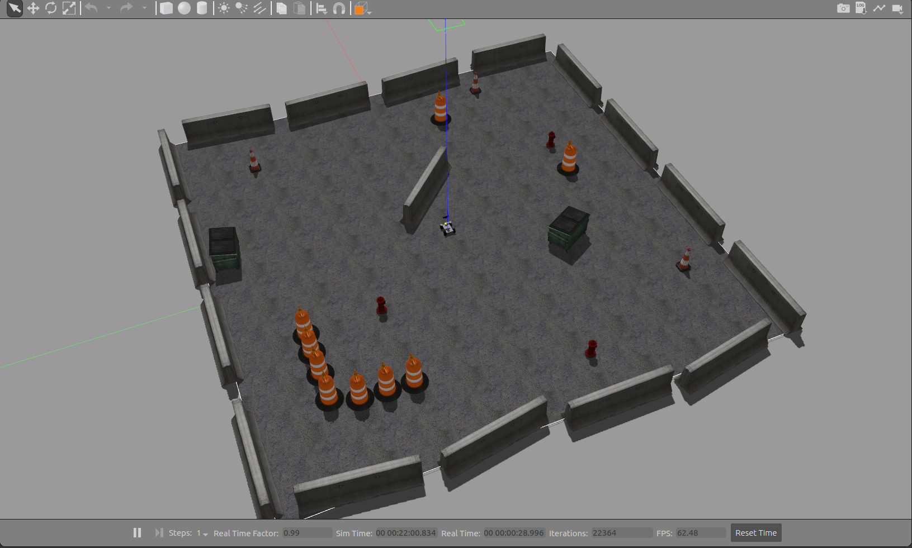

# ERP42 ROS packages

ROS melodic version must be installed.

If it is not installed, go to [here](http://wiki.ros.org/melodic/Installation/Ubuntu) and follow the instructions.

### Dependency

- ROS Dependencies

  ~~~
  $ sudo apt install ros-melodic-serial ros-melodic-velodyne* ros-melodic-pcl* ros-melodic-geodesy ros-melodic-ros-control ros-melodic-map-server ros-melodic-move-base ros-melodic-teleop-twist-keyboard ros-melodic-serial*
  ~~~

- Python Dependencies

  ~~~`
  $ pip install keyboard Sphinx
  ~~~

- Install PCAN Driver Package

  - Unzip after download [Driver Package](https://www.peak-system.com/fileadmin/media/linux/index.htm)

  - Install required package

    ~~~
    $ sudo apt-get update -y
    $ sudo apt-get install -y gcc-multilib
    $ sudo apt-get install libelf-dev
    $ sudo apt-get install libpopt-dev
    ~~~

  - Go to the unzipped folder and make

    ~~~
    $ cd peak-linux-driver-8.10.1
    $ make
    ~~~

  - Build and install

    ~~~
    $ make -C lib 
    $ make -C test 
    $ sudo make install 
    ~~~

  - Check that the installation was successful

    ~~~
    $ sudo modprobe pcan
    $ pcaninfo
    ~~~

    

### Usage

- Adding a source workspace

1. Create a new workspace

   ~~~
   $ mkdir -p ~/erp42_melodic_ws/src
   ~~~

2. Add any custom source packages to the ~/erp42_melodic_ws/src directory.

3. After adding  packages, make sure any necessary dependencies are installed

   ~~~
   $ cd ~/erp42_melodic_ws/src
   $ git clone https://github.com/jdj2261/ERP42-ROS.git
   $ rosdep install --from-paths src --ignore-src -r -y
   ~~~

4. Build the workspace

   ~~~
   $ cd ~/erp42_melodic_ws/
   $ catkin_make
   ~~~

5. source your new workspace instead of the base melodic install.

   ~~~
   $ source ~/erp42_melodic_ws/devel/setup.bash
   ~~~

   `If you bother typing each time, copy it to .bashrc file`

   ~~~
   $ vi ~/.bashrc
   - Go to the bottom and copy the line below
   source ~/erp42_melodic_ws/devel/setup.bash --extend 
   - Press esc key and enter :wq to save and exit.
   ~~~

### Demo 

There are two ways to use this package.

It can be used in **real environment** and **virtual environment** using Gazebo simulator.

- Preacquisition

  

    
Persistent names for usb-serial devices
 

  Give the device a name to /dev/aten instead of /dev/ttyUSB0 to prevent the device name from being changed < [reference](http://hintshop.ludvig.co.nz/show/persistent-names-usb-serial-devices/) >

  ~~~
  $ cd ERP-ROS/rules
  $ sudo ./device_setting.sh
  ~~~

  

  

    
How to solve Gazebo error
 

  ~~~
  $ cd ~/.ignition/fuel/config.yaml
  change
  url: https://api.ignitionfuel.org
  to
  url: https://api.ignitionrobotics.org
  ~~~

  < [reference](https://stella47.tistory.com/12) >

  

**Real environment** 

- excute core package

  `$ roslaunch erp42_bringup erp42_core.launch`

- excute velodyne vlp-16 package (optional)

  `$ roslaunch erp42_bringup erp42_velodyne.launch`

**Gazebo**

- excute **virtual track demo** recommended for **line tracking**.

  ` roslaunch erp42_vehicle_gazebo erp42_track_gazebo.launch`

  <left></left>

- excute **virtual environment** demo recommended for **slam and navigation**.

  ` roslaunch erp42_vehicle_gazebo erp42_vehicle_gazebo.launch`
  
  <left></left>