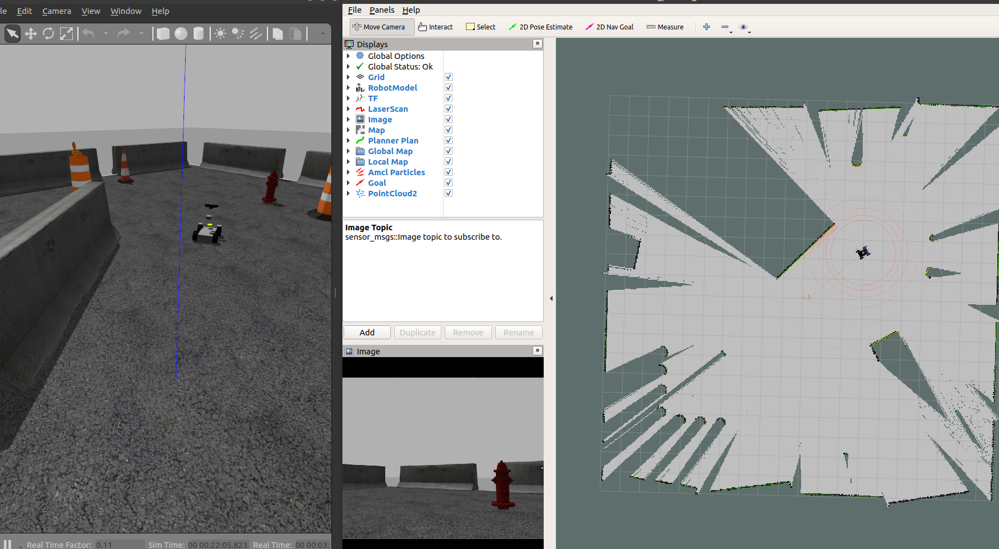

# erp42_slam

This is a slam package using the ros open package. 

It consists of **erp42_cartographer** and **erp42_gmapping** launch file 

Please refer to [here](https://google-cartographer-ros.readthedocs.io/en/latest/compilation.html#building-installation) to create a separate Cartographer workspace.

### Usage

**If you want to use the Cartographer package,**

first, source cartographer workspace 

~~~
$ cd cartographer_ws
$ source install_isolated/setup.bash
~~~

After that, enter the following command to execute.

`roslaunch erp42_slam erp42_cartographer.launch `

**If you want to use the Gmapping package**,

`roslaunch erp42_slam erp42_gmapping.launch `

**You need a teleop keyboard to move the robot.**

`rosrun teleop_twist_keyboard teleop_twist_keyboard.py`

**When the map is finished**, 

`rosrun map_server map_saver -f map_name`

### Demo

***You can test the slam in the Gazebo environment.***

**Demo Cartographer**,

`roslaunch erp42_vehicle_gazebo erp42_vehicle_gazebo.launch`

`roslaunch erp42_slam erp42_cartographer.launch `

**Demo Gmapping**,

`roslaunch erp42_vehicle_gazebo erp42_vehicle_gazebo.launch`

`roslaunch erp42_slam erp42_gmapping.launch `

